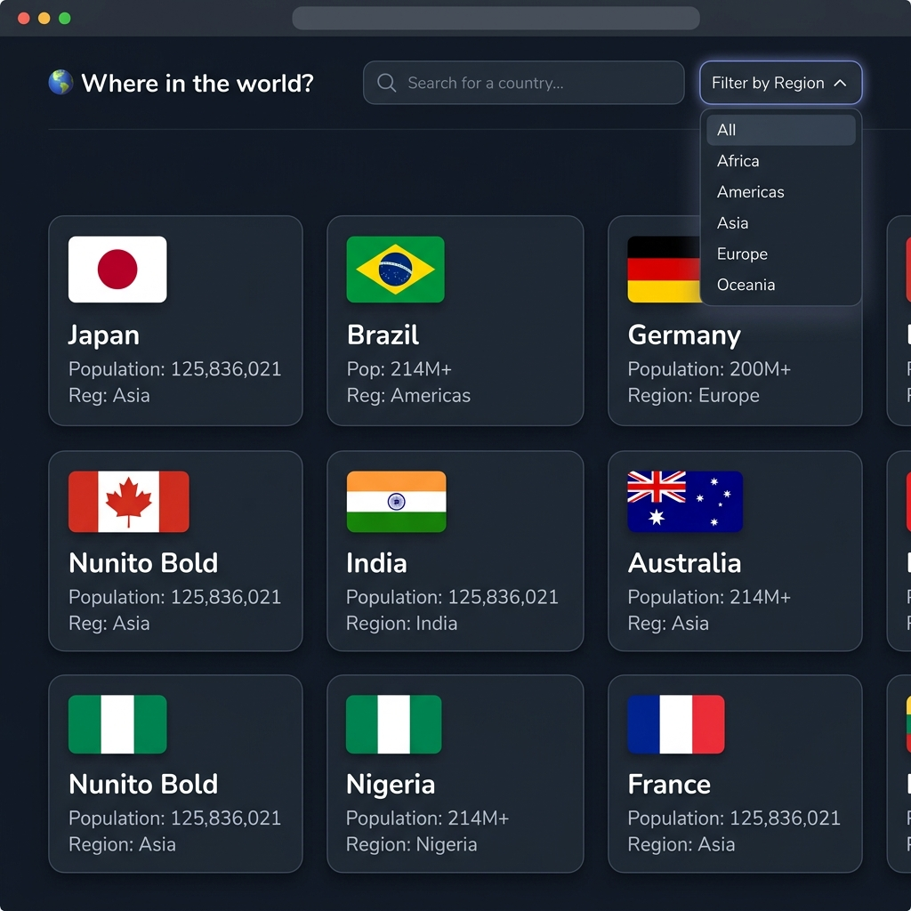

# 🌍 Where in the world? - Countries Information App

[](https://reactjs.org/)
[](https://parceljs.org/)
[](https://developer.mozilla.org/en-US/docs/Web/JavaScript)

A sleek, responsive, and highly interactive web application that provides comprehensive information about countries across the globe. Built with a focus on modern UI/UX and seamless performance using **React 19** and **Parcel**.



[**🔗 Live Demo**](https://gak92-rest-countries-explorer.netlify.app/) | [**📁 Repository**](https://github.com/gak92/rest-countries-explorer)

## ✨ Key Features

- 🌓 **Dynamic Theme Switching**: Seamlessly toggle between Light and Dark modes with persistent user preference (Context API).
- 🔍 **Real-time Search**: Instant search functionality to find countries by name.
- 🗺️ **Region Filtering**: Filter countries by their respective regions (Africa, Americas, Asia, Europe, Oceania).
- 📱 **Responsive Design**: Fully optimized for mobile, tablet, and desktop viewports.
- ⚡ **Optimized Performance**: Bundled with Parcel for lightning-fast load times and HMR (Hot Module Replacement).
- 🏛️ **Detailed View**: Deep dive into country specifics including native names, border countries (with navigation), currencies, and more.
- 🌀 **Shimmer UI**: Elegant loading states to enhance user experience while fetching data.

## 🛠️ Tech Stack

- **Frontend Core**: React 19 (Hooks, Context API, Custom Hooks)
- **Routing**: React Router DOM 6
- **Tooling**: Parcel Bundler
- **Icons**: Font Awesome 6
- **Typography**: Nunito (Google Fonts)
- **Styling**: Vanilla CSS (Custom properties for theming)

## 🚀 Getting Started

To get a local copy up and running, follow these simple steps:

### Prerequisites
- Node.js (v16.x or higher)
- npm or yarn

### Installation

1. **Clone the repository**
   ```bash
   git clone https://github.com/gak92/rest-countries-explorer.git
   ```

2. **Navigate to the project directory**
   ```bash
   cd rest-countries-explorer
   ```

3. **Install dependencies**
   ```bash
   npm install
   ```

4. **Start the development server**
   ```bash
   npm start
   ```

5. **Build for production**
   ```bash
   npm run build
   ```

## 📂 Project Structure

```bash
├── components/         # Reusable UI components (Header, Card, Details, etc.)
├── contexts/           # State management using React Context (Theming)
├── hooks/              # Custom React hooks (useTheme, etc.)
├── screenshots/        # Project preview images
├── index.html          # Application entry point
├── index.js            # React root initialization
├── App.jsx             # Main App component with routing
└── App.css             # Root styles and theme tokens
```

## 📜 License

Distributed under the ISC License. See `LICENSE` for more information.

---
*Created with ❤️ for better web experiences.*
